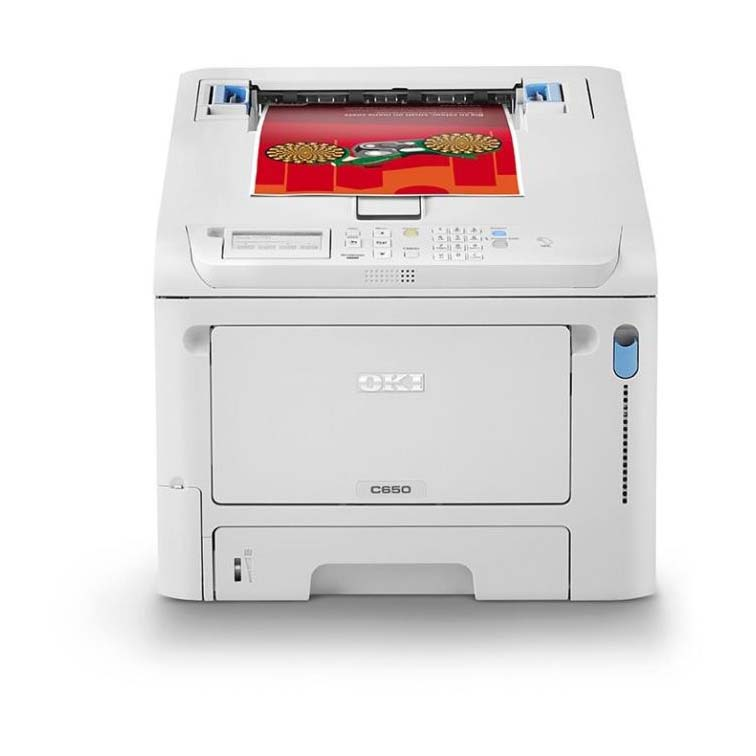

# IMPRESORA LASER A COLOR

*[Página de interés](https://www.hp.com/es-es/shop/product.aspx?id=4ZB96A&opt=B19&sel=PRN&gad_source=1&gclid=CjwKCAiA6t-6BhA3EiwAltRFGONUrrSm_IR4IBchC8UdYX7hHt50XVbGiQ6LTlC7iOd89PlmWS4IVhoCN-wQAvD_BwE&gclsrc=aw.ds)*

*[Pagina Comercial](https://amzn.eu/d/7wvrIbp)*

## Descripción:
Se caracterizan por poder imprimir en color, disponen de un tóner de cada color y además, pueden imprimir documentos en monocromo. Muy útiles para las empresas o negocios que necesitan imprimir tanto documentos a color, como en blanco y negro.

## Diagrama

## Año de Aparicion:
1985 aparece la primera impresora láser color comercializada para las empresas, era la Ricoh color 5000. La primera impresora con toner ricoh del mercado a color.

## Ventajas:
 ### 1º.- Ahorro. 
 El coste de impresión de una copia con impresora láser es más económica que con la inyección de tinta. Aunque los consumibles de una impresora láser son más caros suelen tener mayor rendimiento que los cartuchos de tinta, por lo que realmente el coste por copia es mucho más bajo.

### 2º.- Rapidez. 
Una de sus características fundamentales es que imprimen las páginas completamente no por secciones, esto permite que el proceso sea mucho más rápido y aunque necesitan calentar inicialmente el fusor antes de imprimir la primera hoja, a partir de ahí su velocidad es mucho mayor que la de un modelo de inyección de tinta. Las impresoras láser más lentas del mercado imprimen unas 25 hojas por minuto, si las comparamos con las básicas de tinta que imprimen entre 6 y 8 páginas por minuto,observamos que la diferencia es considerable.

### 3º.- Alto rendimiento. 
Son impresoras preparadas para trabajos de gran volumen, evitaremos así atascos y problemas a la hora de imprimir trabajos de muchas páginas.

### 4º.- Silencio. 
Las impresoras láser son mucho más silenciosas que las de tinta.

### 5º.- Calidad de impresión. 
En términos de calidad , los textos son más nítidos y precisos que los impresos con un modelo de inyección de tinta, que además pueden emborronarse y perder calidad. Aún imprimiendo en calidad borrador la imagen es de mayor calidad en una impresora láser.

### 6º.- Consumibles. 
El consumible de una impresora láser es polvo por lo que no tendremos el problema de que se seque, evapore o caduque como la tinta.

## DESVENTAJAS

### 1º.- Precio. 
Aunque el coste por copia en blanco y negro o escala de grises es más bajo, el desembolso inicial de la impresora es mayor. Las impresoras láser suelen ser más caras que las impresoras de tinta y más sin elegimos una láser multifunción.

### 2º.- Temperatura: 
Cuando realices impresiones de muchas páginas se calientan más que las impresoras de tinta. Sin embargo esta situación se da en las impresoras de gama baja, las de gama alta vienen preparadas técnicamente para evitar que se recalienten.

### 3º.- Baja calidad fotográfica.
 Aunque las impresoras láser de alta gama imprimen fotografías de una calidad aceptable, sin embargo no consiguen la calidad fotográfica de los modelos de inyección de tinta pensados para esta finalidad.

### 4º.- La primera impresión. 
En estas impresoras debe calentarse el fusor al empezar a imprimir por lo que la primera impresión siempre es más lenta.