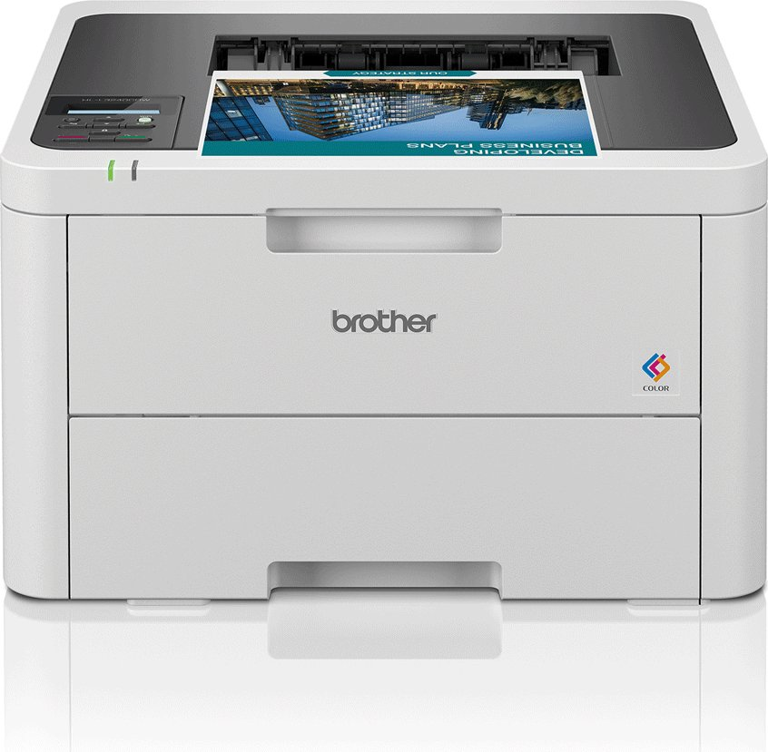
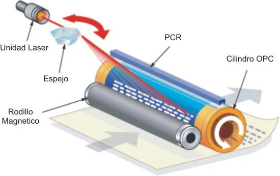

# 💡 Impresora LED

## 🌐 Referencia de Interés
- [Tecnología de Impresión LED](https://www.xerox.es/oficina/latest/W74WP-01.PDF)

## 🛒 Referencia Comercial
- [Impresora LED  en Amazon](https://www.amazon.es/Brother-MFCL2800DW-Impresora-multifunci%C3%B3n-autom%C3%A1tica/dp/B0CK2PVJSR/ref=sr_1_8?adgrpid=59913256687&dib=eyJ2IjoiMSJ9.qZb27d7ICzwRYr8Cx_c0VwG8O7hMT6SNq-uHPiYcXe9WKGYYPm1jjkCEfC4WwDkrqVMHmU4etnOQo6L1I51j6uGol8CPnCeH5qxl0iMVN0ZTwuKDXkHPXvmXs24bmtg_RV5uKEbLW36P59NH8VqTv5QlTvx292WBHkmiADEvHN2_GjaggEvhDLtdVQuSRM9VKBN5D0gQHNdXGjg-OKspq87NuILVal1qCoLt_6zfnD8RoVZq2hqvSDty9KB44W-q0yWPg6NpzF24nydYxrPIRaTggAZ4DuX-JxCSMipEogY.-IjJzQGx7TGyz1IwFzXCnjwxBmLKXpq9sNvZnrqj5js&dib_tag=se&hvadid=601315053271&hvdev=c&hvlocphy=9219525&hvnetw=g&hvqmt=b&hvrand=15111122160265364370&hvtargid=kwd-296894513925&hydadcr=29770_2381694&keywords=impresora+l%C3%A1ser&nsdOptOutParam=true&qid=1733941014&sr=8-8)

## 🖼️ Imagen Representativa
Impresora LED

## 📐 Diagrama Técnico
Diagrama Técnico Impresora LED

## 📝 Descripción
La impresora LED es un tipo de impresora digital que utiliza diodos emisores de luz (LED) en lugar de un láser tradicional para proyectar la imagen a imprimir en un tambor fotosensible.

## 📅 Fecha de Invención
- 🕰️ Desarrollo inicial: Década de 1980
- 🚀 Comercialización: Principios de 1990

## 📊 Ventajas y Desventajas

### 👍 Ventajas
- Mayor velocidad de impresión 🚄
- Menos piezas móviles, aumenta fiabilidad 🛡️
- Componentes más compactos y ligeros 🏋️‍♀️
- Menor consumo de energía ⚡
- Buena calidad de impresión para texto y gráficos 📄

### 👎 Desventajas
- Calidad de impresión de imágenes menos detallada 🖼️
- Generalmente monocromáticas ⚫
- Costo inicial más alto 💸
- Limitaciones para impresión de alta resolución fotográfica 📷
- Mantenimiento más especializado 🔧