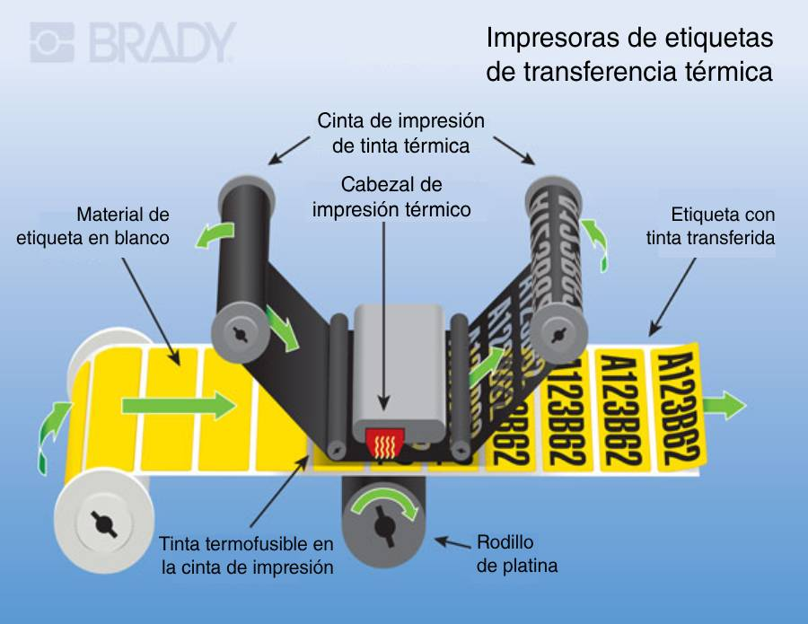
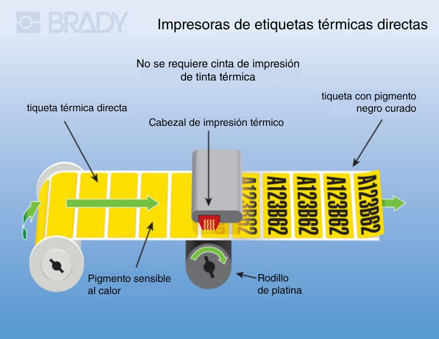
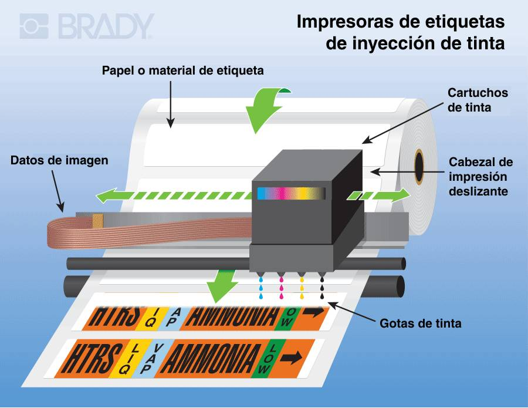
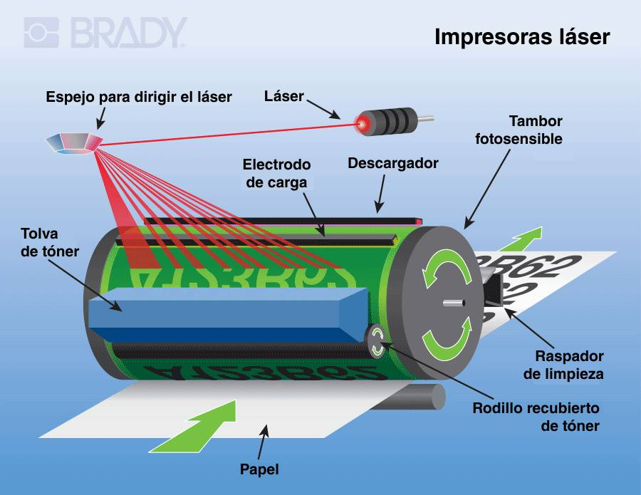

# Impresoras de etiquetas modernas

- [Impresoras de etiquetas modernas](#impresoras-de-etiquetas-modernas)
  - [Impresoras de transferencia térmica :hotsprings:](#impresoras-de-transferencia-térmica-hotsprings)
  - [Impresoras de etiquetas térmicas directas :hotsprings:](#impresoras-de-etiquetas-térmicas-directas-hotsprings)
  - [Impresoras de inyección de tinta :black_nib:](#impresoras-de-inyección-de-tinta-black_nib)
  - [Impresoras de etiquetas láser :flashlight:](#impresoras-de-etiquetas-láser-flashlight)

Esta guía sacada de [Brady](https://www.bradyid.com.mx/impresoras-de-etiquetas/guia-de-tipos-de-impresora) es ideal para comprender los diferentes tipos de impresoras de etiquetas que existen en el mercado.

Las impresoras industriales de etiquetas hacen posible la comunicación. Identifican productos, marcan cables y ayudan a rastrear activos – y eso es sólo el principio. Desde etiquetas de código de barras para trabajo en proceso hasta coloridas etiquetas de marca, las impresoras hacen el trabajo.

Pero, ¿cuál impresora funciona mejor? ¿Térmica directa? ¿De transferencia térmica? ¿De inyección de tinta? ¿Láser?

Este artículo responde esa pregunta, usando términos simples, visuales y comparaciones. También cubre las tecnologías y las aplicaciones de impresión, además desglosa las ventajas de cada tipo de impresora. Antes de añadir una impresora o de cambiar de modelo, conozca cuál es la mejor para usted.

## Impresoras de transferencia térmica :hotsprings:

Estas impresoras de etiquetas usan cintas de impresión cubiertas de cera o de resina para transferir la tinta a las etiquetas cuando son calentadas. La cinta de impresión es intercalada entre el cabezal de impresión y la etiqueta. Cuando el cabezal de impresión pasa encima de la cinta de impresión, calienta el revestimiento de la cinta, transfiriéndolo a la etiqueta para crear una imagen.

Si lo que busca es calidad de impresión sin igual y durabilidad para aplicaciones a largo plazo, las impresoras de transferencia térmica son una excelente opción. Proporcionan impresión nítida y de alta definición de textos, gráficos y códigos de barras que [resisten sustancias químicas](https://www.bradyid.com.mx/etiquetas/quimico-resistentes), luz UV, abrasión, humedad y temperaturas extremas.

Use esta tecnología de impresión para **etiquetas que tienen que ser duraderas**, tales como las etiquetas de código de barras o para rastreo de activos. Las etiquetas impresas por transferencia térmica son también ideales para identificar cables y alambres, cuando se requieren frecuentes instalaciones y actualizaciones para mantenerse seguros y en cumplimiento.

## Impresoras de etiquetas térmicas directas :hotsprings:

Estas impresoras usan etiquetas tratadas químicamente que se oscurecen cuando son calentadas. Un cabezal de impresión caliente entra en contacto directo con las etiquetas para producir una imagen. Este método de impresión es simple y no requiere de una cinta de impresión o tinta.

Si necesita que las etiquetas duren 6 meses o menos, las impresoras térmicas directas son la mejor opción. Son una gran opción para aplicaciones de una vez donde las imágenes y el texto impresos son leídos y escaneados en interiores.

Las etiquetas temporales son útiles en una variedad de aplicaciones. Algunos ejemplos populares incluyen rastreo a corto plazo de productos, pases de visitas, etiquetas de inventario y brazaletes de pacientes. Básicamente, la impresión térmica directa es para identificación que sólo necesita durar un período corto de tiempo.

## Impresoras de inyección de tinta :black_nib:

La tecnología de inyección de tinta es simple pero precisa. Estas [impresoras de etiquetas](https://www.bradyid.com.mx/impresoras-de-etiquetas/inkjet) rocían pequeñas gotas de tinta en las etiquetas sin que el cabezal de impresión toque el material de las etiquetas. Los puntos de tinta tienen 100 micras de ancho (una micra es una milésima de milímetro) y requieren un posicionamiento preciso para lograr imágenes de alta calidad.

Use impresión de inyección de tinta para imprimir de forma personalizada señalización e identificación única. Estas impresoras ofrecen impresión de alta calidad con poco mantenimiento. Además, requieren muy poco tiempo de configuración y ajustes.

Gracias a las capacidades de color de una impresora de inyección de tinta, es ideal para mensajes de seguridad como lo son el etiquetado de [arco eléctrico](https://www.bradyid.com.mx/aplicaciones/requisitos-para-el-etiquetado-de-arco-electrico) y de materiales peligrosos. También puede ser usada para marcar plantas: marcaje de tuberías, señales de dirección y procesos de manufactura esbelta y 5S. Y en laboratorios, cambiar a impresión de colores reduce errores y facilita la identificación de muestras.

## Impresoras de etiquetas láser :flashlight:

Estas impresoras de etiquetas funden polvo de tóner sobre las etiquetas para producir una impresión. Usan una carga eléctrica para atraer el tóner de su cartucho a un tambor. En seguida, las partículas de tóner son presionadas en las etiquetas mientras que el calor de un fusor fija la imagen en su lugar.

Las impresoras láser funcionan para impresión de alta velocidad. Producen una apariencia profesional limpia, especialmente para impresión de texto. Conocidas por su eficiencia y su bajo costo de operación, son ideales para crear documentos, boletos y reportes.

