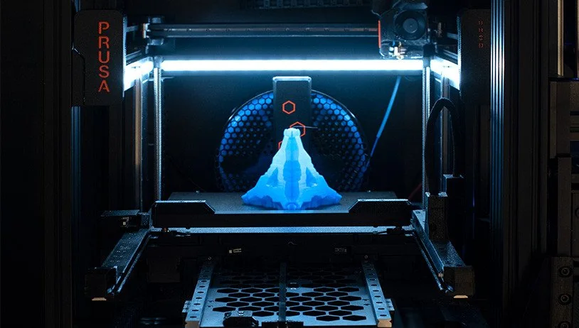
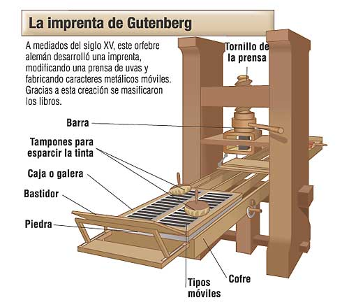
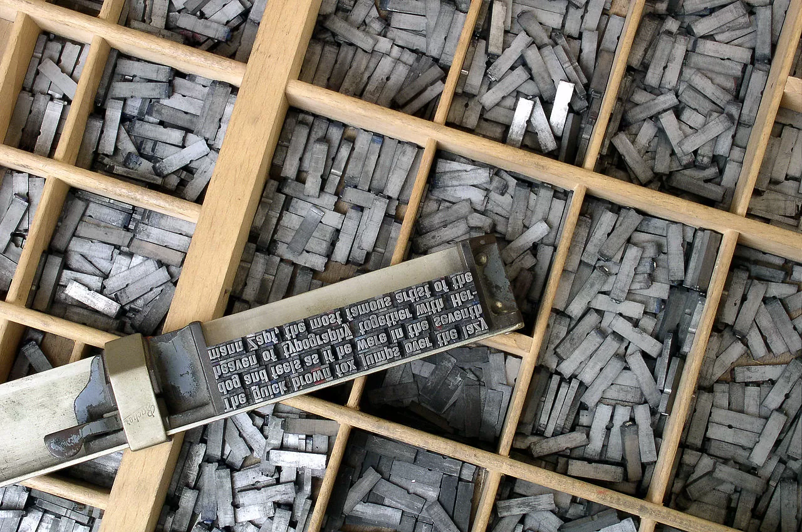
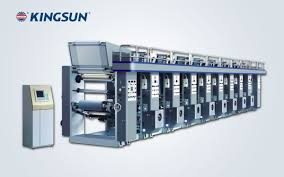
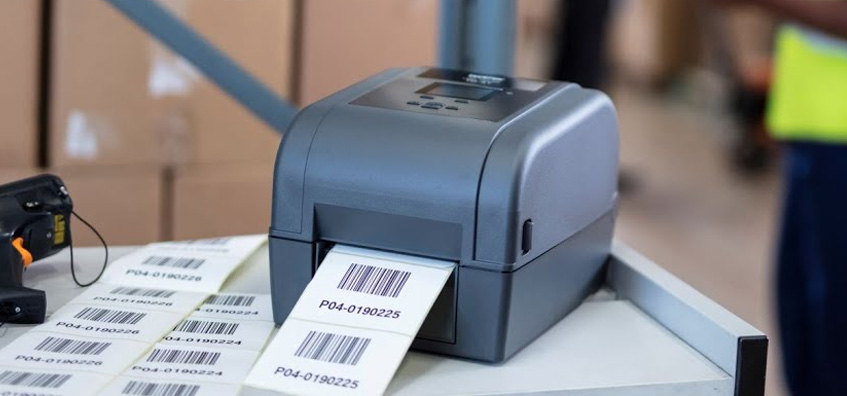
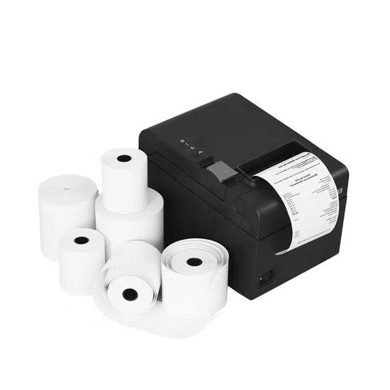
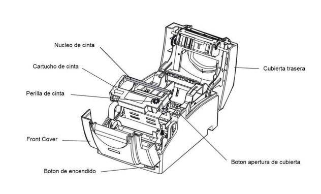
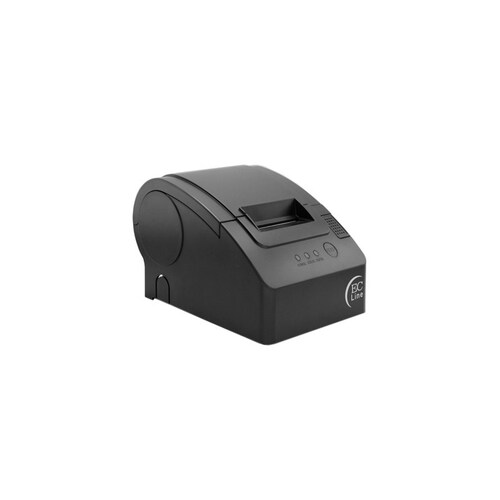
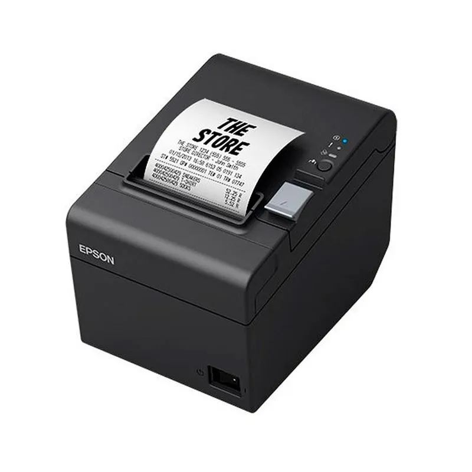

### Contenido de: V:\lanbide\MF0954_2 ReparaciÛn\ReparaciÛn de Impresoras\Impresoras.md

# Impresoras

- [Impresoras](#impresoras)
- [Orígenes de la impresión mecanizada :nut\_and\_bolt:](#orígenes-de-la-impresión-mecanizada-nut_and_bolt)
- [Timeline de la impresión](#timeline-de-la-impresión)
- [Tarea](#tarea)
  - [Numeros por persona](#numeros-por-persona)
- [Tipos de impresoras :fax:](#tipos-de-impresoras-fax)
    - [Por Tecnología de Impresión](#por-tecnología-de-impresión)
    - [Por Uso o Sector](#por-uso-o-sector)
    - [Por Funcionalidad Adicional](#por-funcionalidad-adicional)
    - [Por Formato / Tipo de Salida](#por-formato--tipo-de-salida)

# Orígenes de la impresión mecanizada :nut_and_bolt:

La reproducción de textos e imágenes ha sido una necesidad constante en la historia de la humanidad. Antes de la aparición de las impresoras electrónicas modernas, la referencia más destacada en la evolución técnica de la impresión fue la invención de la **imprenta de tipos móviles** por **Johannes Gutenberg** en el **siglo XV**. Este logro supuso una verdadera revolución cultural al permitir la producción masiva de libros y documentos a un costo mucho más reducido que los manuscritos realizados a mano. Aunque la imprenta de Gutenberg no era electrónica, su impacto sentó las bases para la evolución posterior de la impresión, pasando por sistemas mecánicos, eléctricos y finalmente electrónicos, que culminan en las impresoras que hoy conocemos.

*Imprenta de [Gutenberg](https://es.wikipedia.org/wiki/Johannes_Gutenberg)*

*Tipos móviles*

# Timeline de la impresión

TODO

- 3- Impresora de línea 1959 

# Tarea

Crear un documento para cada tipo de impresora entre las asignadas m√°s abajo.

1. Debe estar contenido en una carpeta propia de nombre el nombre de la impresora con el numero delanta.
2. Crear documento de mardown `.md`.
3. Cada documento debe contener:
   1. Referencia de internet a pagina de interes sobre esta impresora.
   2. Referencia a impresora comercial, p.e. enlace de amazon a una impresora de este tipo o pagina de fabricante.
   3. Imagen representativa de la impresora nombrar la imagen con el numero y el nombre de la impresora.
   4. Diagrama tecnico de la impresora.
   5. Descripción de la impresora.
   6. Fecha de invención (si es posible) sino fecha de aparición en el mercado sino fecha aproximada.
   7. Ventajas y desventajas.
[adsd]()

[ver ejemplo para impresoras de etiquetas industriales.](./Impresora%20de%20etiquetas/Impresora%20de%20etiquetas.md)

## Numeros por persona

- Abellah (5 n√∫meros): 2, 9, 21, 23, 37
- Ingrid (4 n√∫meros): 6, ‚úÖ10, 14, 35, 39
- Mauricio (4 n√∫meros): ‚úÖ3, ‚úÖ7, ‚úÖ15, ‚úÖ32
- Mohamed (4 n√∫meros): 1, 8, 16, 30
- Moncef (4 n√∫meros): ‚úÖ4, ‚úÖ12, ‚úÖ17, ‚úÖ29
- Bilal (4 n√∫meros): 5, 13, 27, 36
- Oier (4 n√∫meros): ‚úÖ11, ‚úÖ20, ‚úÖ22, ‚úÖ34
- Josue (4 n√∫meros): ‚úÖ18, ‚úÖ25, ‚úÖ31, ‚úÖ38
- Annia (4 n√∫meros): 19, 24, 26, 33
- Mikel: Timeline

# Tipos de impresoras :fax:

A continuación se presenta una clasificación amplia de distintos tipos de impresoras, organizadas por diferentes criterios:

### Por Tecnología de Impresión

1. Impresora matricial (dot matrix)  
2. Impresora de margarita (daisy wheel)  
3. [Impresora de línea](<3. Impresora de Linea/Impreaora de Linea.md>)
4. [Impresora de inyección de tinta con cabezales térmicos ](<4. Impresora de inyección de tinta con cabezales termicos/impresora de inyección de tinta con cabezales.md>)
5. Impresora de inyección de tinta con cabezales piezoeléctricos  
6. Impresora l√°ser monocromo  
7. Impresora l√°ser a color  
8. Impresora LED  
9. [Impresora térmica directa](<10. Impresora de transferencia térmica/Impresora de transferencia térmica.md>)
10. Impresora de transferencia térmica  
11. [Impresora de sublimación de tinta](<11. Impresoras de sublimación/Impresoras de sublimación.md>)  
12. [Impresora de tinta sólida (solid ink)](<12. Impresora de tinta sólida  (solid ink )/Impresora de tinta sólida (solid ink).md>)
13. Impresora fotográfica dedicada (basada en inkjet o sublimación)  
14. Impresora 3D FDM (Modelado por Deposición Fundida)  
15. [Impresora 3D SLA (Estereolitografía)](<15. Impresora 3D SLA (Estereolitografía)/Impresora 3D SLA (Estereolitografía).md>)
16. Impresora 3D SLS (Sinterizado Selectivo por L√°ser)  
17. [Impresora 3D DLP (Procesamiento Digital de Luz)](<17. Impresora 3D DLP (Procesamiento Digital de Luz)/Impresora 3D DLP (Procesamiento Digital de Luz) .md>)
18. [Impresora 3D PolyJet](<18. Impresora-3D-PolyJet/Impresora-3D-PolyJet.md>) 
19. Impresora 3D Binder Jetting  
20. [Impresora 3D met√°lica (DMLS, EBM)](<20. Impresora 3D Met√°lica/Impresora 3D Met√°lica.md>)

---

### Por Uso o Sector

21. Impresora doméstica (generalmente inkjet)  
22. [Impresora de oficina o empresarial (láser, multifunción)](<22. Impresora de oficina/Impresora de oficina.md>)
23. Impresora fotográfica profesional (alta calidad, inkjet o sublimación)  
24. Impresora industrial/comercial de gran formato (plotter)  
25. [Impresora offset digital (industrial)](<25. Impresora offset digital (industrial)/Impresora-offset-digital-(industrial).md>)
26. Impresora de flexografía digital (industrial)  
27. Impresora de rotograbado digital (industrial)  
28. [Impresora de etiquetas y códigos de barras (industrial/comercial)](./Impresora%20de%20etiquetas/Impresora%20de%20etiquetas.md)  
29. [Impresora POS (punto de venta, generalmente térmica) ](<29 . Impresora POS/29. Impresora POS (punto de venta, generalmente térmica) .md>)
30. Impresora para tarjetas pl√°sticas (PVC)  
31. [Impresora portátil o móvil (impresoras de bolsillo)](<31. Impresora portátil o móvil(impresora de bolsillo)/Impresora portátil o móvil (impresora de bolsillo).md>)

---

### Por Funcionalidad Adicional

32. [Impresora multifunción (MFP: impresora, escáner, copiadora y ocasional fax) ](<32.Impresora Multifuncion/32.Impresora Multifuncion.md>)  
33. Impresora con conectividad avanzada (Wi-Fi, Bluetooth, impresión en la nube)  
34. [Impresora con funciones de seguridad y gestión avanzada (cifrado, autenticación)](<34. Impresora con funciones de seguridad/Impresora con funciones de seguridad.md>)

---

### Por Formato / Tipo de Salida

35. Impresora para formatos est√°ndar (A4, A3, A2, etc.)  
36. Impresora fotogr√°fica mini (formato reducido, ej. 10x15 cm)  
37. Plotter (para planos, diseños CAD y gran formato)  
38. [Impresora de etiquetas y códigos de barras (térmicas, uso comercial)](<38. Impresora de etiquetas y códigos de barras (térmicas, uso comercial)/Impresora de etiquetas y códigos de barras (térmicas, uso comercial).md>)
39. Impresora de tickets/recibos (POS, pequeñas y rápidas)

---

Este listado, aunque puede presentar algunas superposiciones entre categorías, ofrece una visión amplia y enumerada de distintos tipos de impresoras existentes en el mercado y en la industria actual. En total se han enumerado 39 tipos.

Cada tipo de impresora tiene sus ventajas y desventajas, y la elección de una u otra dependerá de las necesidades específicas de cada usuario o entorno de impresión.

### Contenido de: V:\lanbide\MF0954_2 ReparaciÛn\ReparaciÛn de Impresoras\1.Impresora matricial (dot matrix)\Impresora matricial (dot matrix).md

# Impresora Matricial (Dot Matrix)

## Referencia de Interés
- [Historia de Impresoras Matriciales](https://www.profesionalreview.com/2021/10/02/impresora-matricial-que-es/)

## Referencia Comercial
- [Impresora Matricial Epson LX-350 en Amazon](https://www.amazon.es/Epson-DR000103-LX-350-Impresora-matricial/dp/B00AC3S18S/ref=asc_df_B00AC3S18S?mcid=58f88d63dbc43123b1fb974876a88005&tag=googshopes-21&linkCode=df0&hvadid=699690028245&hvpos=&hvnetw=g&hvrand=1741630754448173325&hvpone=&hvptwo=&hvqmt=&hvdev=c&hvdvcmdl=&hvlocint=&hvlocphy=9219525&hvtargid=pla-631862899820&psc=1&gad_source=1)

## Imagen Representativa
Impresora Matricial 

## Diagrama Técnico
Diagrama Técnico Impresora Matricial

## Descripción
La impresora matricial, también conocida como impresora de punto, es un tipo de impresora de impacto que forma caracteres y gráficos golpeando una matriz de puntos contra una cinta entintada, dejando una marca sobre el papel. Utiliza una cabeza de impresión con múltiples agujas (generalmente entre 9 y 24) que se mueven vertical y horizontalmente para crear caracteres y gráficos.

## Fecha de Invención
- Invención: Década de 1970
- Popularización: Principios de 1980

## Ventajas y Desventajas

### Ventajas
- Bajo costo de impresión
- Capacidad para imprimir copias múltiples mediante papel carbón
- Resistente y duradera
- Eficaz para imprimir formularios y documentos de varias capas
- Bajo costo de mantenimiento

### Desventajas
- Calidad de impresión baja
- Ruido alto durante la impresión
- Velocidad de impresión lenta
- Impresión en color limitada o inexistente
- Resolución gráfica limitada

### Contenido de: V:\lanbide\MF0954_2 ReparaciÛn\ReparaciÛn de Impresoras\10. Impresora de transferencia tÈrmica\Impresora de transferencia tÈrmica.md

# Impresora de transferencia térmica

Se usan sobre todo para imprimir tickets y cosas pequeñas, y son de tamaño reducido. Comunes en negocios pequeños y demás.

Se inventó en los Años 70.

 

[impresora de etiquetas brother](https://www.brother.es/impresoras-etiquetas-y-recibos/impresoras-de-etiquetas-sobremesa/impresoras-etiquetas-volumen-impresion-medio-y-resistente)

[Producto en amazon](https://www.amazon.es/Zebra-GX420d-escritorio-mu%C3%B1equeras-Conectividad/dp/B07YQGV1XK?dib=eyJ2IjoiMSJ9.8jOADZvdQRckwr64enwNl0LwE-ZSK_x9MTqvgSbeSBaYRyFczkTnUKgImrxxu5Qg98EQy45YnwhcQlnMIxBDksezrczSWwccCYCo4iKWo5g-sn_n2Hroz9QRLHJgh7fjf1BYRHJGzAUCWt8OUwYJ_crw5yoQ02S1MM524QrIrCXFaI5w8C3Po6EovoKbivj9U4BIZJMaWh2nTBqFz9sGZes32O9PqNKFtKd5U66fqJI6f534dIBeIgyjiAArrvcB8iaBI2DsZr2D5hNumfeMgvDqHBnVIgjz7Q6umnnJPD0._2GKLapnhquB61ETKFiaqv3Py9dHEHSJdTqNGhm3d70&dib_tag=se&keywords=impresora+termica+zebra&nsdOptOutParam=true&qid=1733846218&sr=8-6)

# Diagrama

4: 

# Ventajas y desventajas.

- **Ventajas:** pequeñas, bajo coste, muy rápidas; 

- **desventajas:** olor intenso, baja durabilidad, monocrom√°ticas, requieren papel especial.

Imprime en formato de tickets o recibos.

### Contenido de: V:\lanbide\MF0954_2 ReparaciÛn\ReparaciÛn de Impresoras\11. Impresoras de sublimaciÛn\Impresoras de sublimaciÛn.md

# Impresora de Sublimación de Tinta 

La impresión por sublimación utiliza calor y presión para transferir diseños a diferentes materiales. Es ideal para personalizar ropa, tazas, y otros objetos recubiertos de polímeros. Puedes encontrar información detallada en [Tecno Simple](https://tecno-simple.com/) y [Printful](https://www.printful.com/es).

Un modelo comercial popular es la Epson SureColor F100, disponible en plataformas como Amazon. Puedes ver sus características y adquirirla [aquí](https://www.amazon.es/Impresora-sublimaci%C3%B3n-SureColor-SC-F100-transferencia/dp/B09RF9C4RF?__mk_es_ES=%C3%85M%C3%85%C5%BD%C3%95%C3%91&crid=89L83ZAEDMSO&dib=eyJ2IjoiMSJ9.RVvCnRastJOiUXDcIPylb8eXltHaWwGQDYV7SVWI3PYOMjlv8vAAp94AjN_nVT72larO7xcydDWp7WzxSo8vO1mw8hTdaVCcU-sjLN75acviIvETHor9u3HW8lDJpzY4iVPvICdP3fIqWOl48mF3HoDBkwTvX83Fys5re0k4P54GWD9XFm-Wkz2tbu_ylScLc4YIV2NEivrigQXMQfuL13DnBaNHf-D6VE7LvsT084zVt6KwoAR_uFPO814iH5F2xMPe9wP8UbNioAwaWK5rmxq35BjVcJOor1xbnU_2RrM.hGfVZglMlX7bmWcBJLbowUVXPo_4iWb-fyAmL_cK9tU&dib_tag=se&keywords=epson+sublimacion&nsdOptOutParam=true&qid=1733843997&sprefix=epson+sublimacion%2Caps%2C161&sr=8-8).

### Diagrama Técnico

### Descripción

Una impresora de sublimación utiliza tintas especiales que, mediante calor, pasan de estado sólido a gaseoso sin convertirse en líquido. Estas tintas se integran químicamente con los materiales, creando impresiones de alta calidad y duraderas. Es ideal para personalizar productos de poliéster o superficies recubiertas de polímeros, como tazas, camisetas o fundas de almohadas.

En 1957, Noël de Plasse, inventó la primera máquina que funcionaba con sublimación de tinta pero el uso de la sublimación en impresión se popularizó en los años 80. Aunque no hay una fecha exacta, este método se hizo comercialmente viable en la década de los 90, con avances tecnológicos que lo optimizaron.

### Ventajas y Desventajas
- **Ventajas:**
    - Alta calidad y durabilidad.
    - Diseños a todo color y sin bordes visibles.
    - Resistente al agua y a la decoloración.
    - Ideal para personalización en pequeñas cantidades.

- **Desventajas:**
    - No compatible con materiales oscuros o de algodón puro.
    - Proceso más lento en comparación con otras técnicas.
    - Costos iniciales elevados por los equipos requeridos.
---
[⬅️ Volver al inicio](#impresora-de-sublimación-de-tinta)

### Contenido de: V:\lanbide\MF0954_2 ReparaciÛn\ReparaciÛn de Impresoras\12. Impresora de tinta sÛlida  (solid ink )\Impresora de tinta sÛlida (solid ink).md

# Impresora de tinta sólida (solid ink)

###### brother HL-L3240CDW Laser LED Solid Ink

--- 

##### Historia :
1991 - Primera impresora comercial:

Tektronix lanzó la primera impresora de tinta sólida, la Phaser III. Esta impresora estaba dirigida principalmente a mercados profesionales y de oficina, gracias a su capacidad para producir impresiones de alta calidad en color.

##### Presente :

Tektronix continuó produciendo un par de modelos más a lo largo de la década de 1990 antes de que, en 2000, Xerox comprara la división de impresión de la empresa y, con ella, los derechos de la tecnología de tinta sólida.

---

## Que es una impresora de tinta sólida  ?

- Las impresoras de tinta sólida son un tipo de impresora que imprimen por transferencia termal utilizando barras sólidas de color.

- La tinta se calienta y alimenta una cabeza de impresión que, a su vez, distribuye la tinta en un tambor engrasado, por el cual pasa el papel y hace que la imagen se transfiera.

---

### Ventajas :
- El precio inicial y coste de las copias es similar al de las impresoras láser. Se utilizan como impresoras a color en las oficinas por la alta calidad a la hora de imprimir transparencias y otros medios no porosos y por su gran velocidad de impresión.

- La tinta no es tóxica, por lo que son más ecológicas que las impresoras de cartuchos de tinta y de tóner.
### Desventajas :
- Consumen mucha energía y hay que esperar a que se caliente la máquina para usarla

---

##### Pagína comercial :
https://www.amazon.es/HL-L3240CDW-L%C3%A1ser-LED-s%C3%B3lido-INK/dp/B0CJV67GT7

##### Pagína de interes :

https://www.consumoteca.com/electronica/impresora-de-tinta-solida/

### Contenido de: V:\lanbide\MF0954_2 ReparaciÛn\ReparaciÛn de Impresoras\13.impresora fotografica delicada\Impresora Fotografica delicada.md

Impresora  Fotografica delicada

Tecnología
Método de impresión
Impresora de inyección de tinta de 6 colores
Configuración inyectores
180 Inyectores negro, 900 Inyectores por color
Tamaño máximo gota
1,5 pl
Impresión
Number of colours
6 colour
Velocidad de impresión ISO/IEC 24734
8 p√°ginas/minuto Monocromo, 8 p√°ginas/minuto Color
Velocidad de impresión
22 páginas/minuto Monocromo (Papel Normal 75 g/m²), 22 páginas/minuto Color (Papel Normal 75 g/m²), 25 segundos por foto de 10 x 15 cm (Epson Premium Glossy Photo Paper)

### Contenido de: V:\lanbide\MF0954_2 ReparaciÛn\ReparaciÛn de Impresoras\14. Impresora 3D FDM\Impresora 3D FDM.md

1. Referencia de internet a pagina de interes sobre esta impresora.
   2. Referencia a impresora comercial, p.e. enlace de amazon a una impresora de este tipo o pagina de fabricante.
   3. Imagen representativa de la impresora nombrar la imagen con el numero y el nombre de la impresora.
   4. Diagrama tecnico de la impresora.
   5. Descripción de la impresora.
   6. Fecha de invención (si es posible) sino fecha de aparición en el mercado sino fecha aproximada.
   7. Ventajas y desventajas.

   # Enlaces
   
   1: [Explicación breve de la impresión FDM](https://www.3dnatives.com/es/fdm-o-sla-impresion-3d-131220172/)
   2: [Enlace de Amazon a una impresora 3D FDM](https://www.amazon.es/Flashforge-Adventurer-5M-accionamiento-Desmontable/dp/B0CH9K2KWQ?source=ps-sl-shoppingads-lpcontext&ref_=fplfs&psc=1&smid=A2PEMQJE1RM53F&gQT=1)
   3: 

   # Diagrama

   4: 

   # Descripción

   5: Depositan filamento fundido que luego se endurece para formar figuras en 3D. Son las m√°s conocidas.

   # Fecha de invención/patente/salida al mercado
   6: 1988

   # Ventajas y desventajas

   **Ventajas:** precisas, capacidad 3D, gran soporte de la comunidad.
   
   **Desventajas:** caras, lentas, difíciles de mantener, requieren conocimiento de programas complejos para operarse (Blender, etc.)

### Contenido de: V:\lanbide\MF0954_2 ReparaciÛn\ReparaciÛn de Impresoras\15. Impresora 3D SLA (EstereolitografÌa)\Impresora 3D SLA (EstereolitografÌa).md

### Impresora 3D SLA (Estereolitografía)

*[Pagina de Interes](https://erycop.com/estereolitografia-sla/)*

*[Pagina Comercial](https://www.prusa3d.com/es/producto/prusa-core-one/?country=ES&currency=eur&utm_source=google&utm_medium=cpc&utm_campaign=ES-ES_Search_Shopping_Brand&utm_id=20686082374&gad_source=1&gclid=CjwKCAiA6t-6BhA3EiwAltRFGEu42qE9G-TCusp1OCxWNhBpkqut6lOybEvkGVYSZKXktDea_MVXSRoC1q4QAvD_BwE)*

## Descripción:

La estereolitografía es un proceso de impresión 3D por «polimerización en tanque»: se vierte una resina líquida y fotosensible en un contenedor (o tanque) y la luz UV interactúa con la resina para polimerizarla (endurecerla o solidificarla) 
de forma selectiva.

## Año de Invención:
La estereolitografía (SLA) es la primera tecnología de impresión 3D comercializada, creada por Chuck Hull, cofundador y director de Tecnología de 3D Systems, en 1980. Utiliza un láser ultravioleta para curar con precisión secciones transversales de fotopolímeros, convirtiéndolos de líquidos en sólidos.

## Ventajas

 ### 1. Velocidad: 
   una de las principales ventajas del proceso es que, dependiendo de la pieza que necesites, es su velocidad, ya que el curado es rápido.  El tiempo exacto que tardará dependerá del tamaño, la complejidad y el grosor de las capas de la pieza.  Después de cargar tu CAD, te podemos enviar las piezas en tan solo un día. Esto también lo hace ideal para generar fijaciones de herramientas, que a veces pueden ser una idea tardía y pilla por sorpresa a los ingenieros de fabricación.  El SLA puede ayudar a superar estos descuidos con la creación rápida de accesorios y fijaciones.

### 2. Rentable: 
también puede ser un proceso muy rentable para desarrollar modelos de bajo coste pero precisos.  Esto lo hace ideal para prototipos cosméticos que te ayuden a detectar fallos de diseño antes de pasar a la creación de prototipos más costosos o a la fabricación final.  Para los proyectos adecuados, sobre todo del sector médico, también es una buena opción para la fabricación de tiradas cortas de piezas y permite obtener plazos de entrega rápidos.

### 3. Precisión: 
el SLA es famoso por fabricar piezas extremadamente lisas que pueden incluso rivalizar con el moldeo por inyección.  Se consiguen tolerancias extremadamente buenas para las características de hasta +/- 0,05 mm en los ejes X e Y y de 0,13 mm en el eje Z.  Y con los nuevos materiales, como nuestros propios MicroFineTM Green and Grey, se pueden conseguir piezas de micro resolución, quizás para productos de medicina o de electrónica de consumo.

### 4. El escalado es sencillo

Aunque el tiempo que se tarda en fabricar una pieza puede depender de su tamaño y existen limitaciones de tamaño máximo, es fácil escalar una pieza, ya que el proceso se basa en el CAD.

### 5. Ensamblajes a presión

Al poder tomar los modelos directamente del CAD, se pueden crear montajes basados en muchos componentes que se pueden encajar para formar una pieza más grande.  Esto permite comprobar el ensamblaje y, si hay que hacer modificaciones, cambiar o reimprimir rápidamente el diseño, por lo que es ideal para las pruebas de forma y ajuste.

## Desventajas

### Elección del material

Debido a la naturaleza del curado, para la estereolitografía solo hay un número limitado de materiales.  Además, como ya te habrás dado cuenta, al utilizar un láser UV para curar la resina, las piezas son fotosensibles, por lo que no son adecuadas para aplicaciones de exterior.

Esto también podría afectar a otras características de tus prototipos o piezas.  En otros procesos de impresión 3D, como el sinterizado selectivo por láser, se puede utilizar una gama más amplia de resinas  técnicas que, por lo general, serán más duraderas para fabricara piezas más resistentes. Y lo mismo ocurre con otras características, por lo que si necesitas una mayor resistencia al calor y química, puede que para ti sea más adecuado otro material que utilice una tecnología diferente.

### Contenido de: V:\lanbide\MF0954_2 ReparaciÛn\ReparaciÛn de Impresoras\16.Impresora 3D SLS (Sinterizado Selectivo por L·ser)\Impresora 3D SLS.md

# Impresora 3D SLA (Estereolitografía)

## Referencia de Interés
- [Guía Completa de Impresión SLA](https://www.3dnatives.com/en/sla-3d-printing-guide/)

## Referencia Comercial
- [Impresora Formlabs Form 3 en Amazon](https://www.amazon.com/Formlabs-3L-Desktop-Resin-Printer/dp/B07QZGJZ5Q)

## Imagen Representativa

## Diagrama Técnico

## Descripción
La impresora 3D SLA (Estereolitografía) es un tipo de impresora que utiliza un láser UV para curar y solidificar resina líquida, creando objetos tridimensionales capa por capa. Se caracteriza por su alta precisión y capacidad de producir modelos con detalles muy finos.

## Fecha de Invención
- Invención: 1984 por Chuck Hull
- Patente: 1986
- Comercialización masiva: Década de 2010

## Ventajas y Desventajas

### Ventajas
- Alta precisión y resolución
- Excelente detalle superficial
- Ideal para prototipos y modelos pequeños
- Amplio uso en joyería, odontología y prototipado
- Superficie lisa y acabados de alta calidad

### Desventajas
- Costo elevado de resinas
- Proceso m√°s lento que otras impresoras 3D
- Materiales fr√°giles
- Requiere post-procesamiento (curado UV)
- Limitaciones en tamaño de impresión
- Manejo de resinas requiere precauciones de seguridad

### Contenido de: V:\lanbide\MF0954_2 ReparaciÛn\ReparaciÛn de Impresoras\17. Impresora 3D DLP (Procesamiento Digital de Luz)\Impresora 3D DLP (Procesamiento Digital de Luz) .md

# Impresora 3D DLP (Procesamiento Digital de Luz)

###### Prusa CORE One

---
## ¿Qué es el procesamiento digital de luz (DLP)?

El DLP (procesamiento digital de luz) es una tecnología de impresión 3D utilizada para producir de forma rápida piezas de fotopolímero. Es muy similar a la SLA con una diferencia significativa: mientras que las máquinas de SLA utilizan un láser que traza una capa, una máquina de DLP utiliza una fuente de luz proyectada para curar toda la capa a la vez. La pieza se forma capa a capa.

 - #### para que se utilizan :
   - a impresión DLP puede utilizarse para imprimir artículos con diseños de resina extremadamente intrincados, como juguetes, moldes de joyería, moldes dentales, estatuillas y otros objetos con detalles finos. Al curar toda la capa a la vez, es mucho más rápida que la SLA.  

---

## Historia de la impresión DLP :

Aunque la primera descripción de una impresora 3D fue publicada en 1964 por el autor de ciencia ficción Arthur C. Clarke, no fue hasta 1987 cuando se desarrolló el proceso de estereolitografía o SLA. Poco después le siguió la impresión DLP, que a menudo se compara con la impresión SLA. El procesamiento digital de luz se desarrolló originalmente en 1987.

---

## Ventajas e inconvenientes del DLP (procesamiento digital de la luz)

La tecnología DLP es popular por su alta velocidad de impresión, aunque en el proceso se sacrifica la precisión. Solo utiliza fotopolímeros, que suelen emitir olores que pueden ser problemáticos en un entorno de oficina.

##### Pagína comercial :
https://www.prusa3d.com/es/producto/prusa-core-one/?country=ES&currency=eur&utm_source=google&utm_medium=cpc&utm_campaign=ES-ES_Search_Shopping_Brand&utm_id=20686082374&gad_source=1&gclid=CjwKCAiA6t-6BhA3EiwAltRFGDVO-tYCwteztHO_lPsxtlanCwC8xq3-3AR_J_Nb6sWFEFM_kjoXWhoCoiIQAvD_BwE

##### Pagína de interes :
https://markforged.com/es/resources/learn/3d-printing-basics/3d-printing-processes/what-is-digital-light-processing-dlp

### Contenido de: V:\lanbide\MF0954_2 ReparaciÛn\ReparaciÛn de Impresoras\18. Impresora-3D-PolyJet\Impresora-3D-PolyJet.md

# Impresora 3D PolyJet

*[Página de interés](https://xometry.pro/es/articulos/impresion-3d-polyjet-tecnologia/)*

*[Comercial](https://www.machineseeker.es/stratasys-objet260+connex3/i-15145918?srsltid=AfmBOorGAQW_On9YmQ9DFFnxfPPvN5FT5rcsn3hyrKvJtxKoJpH6QQLYDbg)*

## Descripción

La impresión 3D PolyJet es una tecnología avanzada que crea rápidamente piezas precisas utilizando fotopolímeros, luz UV y cabezales de inyección de tinta. Logra precisión mediante capas de resinas para formar materiales digitales. El proceso comienza con un modelo CAD transformado en un formato imprimible.

## Diagrama Técnico

## Fecha de lanzamiento

 La tecnología PolyJet se introdujo por primera vez en el año 2000 con el lanzamiento de la impresora 3D Quadra.

## Ventajas y desventajas 

### Ventajas

1. Producción de lotes fácil y rápida

2. Excelente precisión dimensional y resolución

3. Menos desperdicio de material

### Desventajas 

1. Tecnología cara

2. Uso de estructuras de soporte

3. Materiales limitados para imprimir

### Contenido de: V:\lanbide\MF0954_2 ReparaciÛn\ReparaciÛn de Impresoras\2-Impresora tÈrmica directa\Impresora tÈrmica directa.md

### Contenido de: V:\lanbide\MF0954_2 ReparaciÛn\ReparaciÛn de Impresoras\20. Impresora 3D Met·lica\Impresora 3D Met·lica.md

# Impresora 3D Met√°lica (DMLS, EBM) 
La impresión 3D metálica se basa en la fabricación aditiva, un método que permite construir objetos capa por capa utilizando polvos metálicos y fuentes de energía específicas. Dos de las tecnologías más destacadas en este campo son la Sinterización Directa de Metales por Láser (DMLS) y la Fusión por Haz de Electrones (EBM). Ambas técnicas ofrecen alta precisión, resistencia y son ideales para sectores como el aeroespacial y la medicina. A continuación, se profundiza en sus características y diferencias.

Para más detalles sobre las tecnologías DMLS y EBM, visita la guía de impresión metálica en [EOS](https://www.eos.info/) y el sitio especializado 3Dnatives.

Un ejemplo destacado de tecnología DMLS es la EOS M 290, utilizada ampliamente en la fabricación de piezas metálicas.

 Para la tecnología EBM, destaca la Arcam EBM Spectra L. 

Puedes encontrar más información en sus páginas oficiales:

[EOS M 290](https://www.eos.info/)
[Arcam EBM Spectra L](https://www.3dmaquinser.com/productos/spectra-l/)

### Diagrama Técnico

*Diagrama técnico de una impresora DMLS*

*Diagrama técnico de una impresora EBM*

### Descripción

#### DMLS (Direct Metal Laser Sintering):
Este método utiliza un láser de alta potencia para fusionar selectivamente capas de polvo metálico en una cámara cerrada. Ideal para crear piezas con alta precisión y densidad, es ampliamente usado en la industria aeroespacial y médica para fabricar componentes personalizados y complejos. 

***Patentada en los años 90 por EOS.***

#### EBM (Electron Beam Melting):
En este proceso, un haz de electrones funde polvo metálico en una cámara de vacío. La tecnología EBM es particularmente útil para materiales resistentes como el titanio y se utiliza en aplicaciones que requieren piezas de alto rendimiento mecánico.

***Introducida comercialmente por Arcam en 1997‚Äã***

 

## Ventajas y Desventajas
##### ***DMLS:***
- **Ventajas:**
    - Alta resolución y precisión geométrica.
    - Aplicable a una amplia gama de aleaciones met√°licas.
- **Desventajas:**
    - Requiere soportes para estructuras complejas.
    - Necesita una atmósfera controlada de gas inerte.
##### ***EBM:***
- **Ventajas:**
    - Excelente para materiales de alto punto de fusión.
    - Proceso m√°s r√°pido para piezas grandes.
- **Desventajas:**
    - Limitado a ciertos metales (como titanio).
    - Requiere un entorno de vacío completo, lo que incrementa los costos.
---
[⬅️ Volver al inicio](#impresora-3d-metálica-dmls-ebm)

### Contenido de: V:\lanbide\MF0954_2 ReparaciÛn\ReparaciÛn de Impresoras\22. Impresora de oficina\Impresora de oficina.md

# Impresora de oficina o empresarial (láser, multifunción)

Las impresoras láser multifunción son una herramienta esencial en oficinas y entornos empresariales por su capacidad para combinar funciones como impresión, escaneo, copiado y, en algunos casos, fax. Estas impresoras se destacan por su rapidez, fiabilidad y costos operativos bajos, lo que las convierte en la opción preferida para el trabajo diario en oficinas.

Para obtener más información sobre impresoras láser multifunción y sus características, puedes visitar [PCMag](https://www.pcmag.com/) o [HP](https://www.hp.com/) para una guía detallada de sus productos.

Un ejemplo destacado es la HP LaserJet Pro MFP M428fdw, una impresora láser multifunción de alto rendimiento diseñada para empresas pequeñas y medianas. Más detalles y opciones de compra están disponibles en su [página oficial](https://www.hp.com/).

## Diagrama Técnico

### Descripción

La impresora láser multifunción combina varias funcionalidades en un solo dispositivo: impresión, escaneo, copiado y, a veces, envío de faxes. Funciona utilizando un láser que carga eléctricamente un tambor para atraer el tóner, que luego se transfiere al papel y se fija mediante calor. Es ideal para entornos de oficina gracias a su rapidez, calidad de impresión profesional y capacidad para manejar grandes volúmenes de trabajo.

Las impresoras láser fueron inventadas por Gary Starkweather en 1969 mientras trabajaba en Xerox, con el primer modelo comercial lanzado en 1977. Las versiones multifunción comenzaron a popularizarse a finales de los años 90.

### Ventajas y desventajas
- ***Ventajas:***
    - Alta velocidad de impresión.
    - Costos operativos bajos por p√°gina.
    - Multifuncionalidad en un solo dispositivo.
    - Excelente calidad de impresión, especialmente para textos.
- ***Desventajas:***
    - Mayor costo inicial en comparación con impresoras de inyección de tinta.
    - No ideal para impresiones de alta calidad en color o fotografías.
    - Requiere más espacio en oficinas pequeñas.
  ---
 [⬅️ Volver al inicio](#impresora-de-oficina-o-empresarial-láser-multifunción)

### Contenido de: V:\lanbide\MF0954_2 ReparaciÛn\ReparaciÛn de Impresoras\25. Impresora offset digital (industrial)\Impresora-offset-digital-(industrial).md

# Impresora offset digital (industrial)

*[Página de interés](https://tecnographic.net/impresion-digital-offset-que-es/#elementor-toc__heading-anchor-2)*

*[Comercial](https://www.exapro.es/man-roland-304-p240304214/)*

## Descripción

La impresión digital offset es un proceso avanzado utilizado en el sector de las artes gráficas que combina elementos de la impresión offset y la impresión digital. Se basa en el uso de una plancha y una mantilla adaptadas a una prensa de impresión para reproducir imágenes en diferentes soportes.

## Diagrama Técnico

## Fecha de Lanzamiento

La impresión digital comenzaró a utilizarse por el año 1993. La idea de crear una prensa de impresión digital comenzó con el desarrollo de la computadora.

## Ventajas y Desventajas 

### Ventajas

1. Alta calidad de impresión

2. Gran variedad de materiales

3. Economía en tirajes pequeños

### Desventajas 

1. Costo por unidad

2. Calidad fotogr√°fica

3. Limitaciones de tipos de papel

### Contenido de: V:\lanbide\MF0954_2 ReparaciÛn\ReparaciÛn de Impresoras\27. Impresora de rotgrabado digital\Impresora de rotograbado digital (industrial).md

### Contenido de: V:\lanbide\MF0954_2 ReparaciÛn\ReparaciÛn de Impresoras\29 . Impresora POS\29. Impresora POS (punto de venta, generalmente tÈrmica) .md

# Impresora POS (punto de venta, generalmente térmica)

###### Epson TM-T20III (RS232) 

---
## ¿Qué es una impresora térmica?

- Las impresoras térmicas son dispositivos electromecánicos que reciben información digital y la plasman físicamente en una hoja, sin hacer uso de tinta.  
  .

- Normalmente este tipo de impresoras imprime únicamente en negro. No obstante, hoy en día existen modelos más avanzados, que pueden imprimir en dos o tres colores.  

.
- Por norma general, el papel para impresoras térmicas se compra en rollos, y está disponible en diferentes medidas, siendo el tamaño estándar el de 40mm de ancho. Para conseguir la impresión deseada, este papel cuenta con una impregnación cerosa, que reacciona con el calor y se vuelve de color negro.
---

## Cómo funciona la impresora térmica 
Las impresoras térmicas funcionan gracias a un mecanismo sencillo. Este consiste en la acción de una serie de agujas calientes, que penetran en un tipo de papel termosensible.  

Este método de impresión no requiere de cartuchos de tinta o tóner, por lo que para hacer uso de estas impresoras tan solo es necesario contar con hojas térmicas.  

---

## Historia :
El término 'impresora térmica' surgió en la década de 1940, cuando el ingeniero eléctrico y físico estadounidense Jack St. Clair Kilby creó la primera de esta categoría a la que actualmente se le suman numerosas marcas y modelos reconocidos que veremos más adelante.

---
### Ventajas :
- Las impresoras por transmisión térmica permiten un ahorro de cartuchos de tinta o cintas.  
- Son muy sencillas de usar, pues no requieren software.  
- Resultan ideales para su uso en oficinas y ambientes tranquilos y libres de ruidos.  
- Están disponibles en distintos modelos y tamaños, por lo que ofrecen una gran versatilidad.  
- Ofrecen una larga vida √∫til, especialmente si las comparamos con otros tipos de impresoras.  
- Permiten una gran eficiencia y rapidez de impresión, algo que resulta especialmente importante en la caja de tiendas y otros negocios que trabajan de cara al público.

### desventajas :
- No imprimen a color.  
- Los cabezales pueden estropearse por un calor excesivo durante la impresión.  
- Algunos modelos ofrecen impresiones poco duraderas, que pueden desaparecer con el tiempo.  
La calidad de impresión puede resultar baja para otros usos.  

---
##### Pagína de interes :
https://www.antalis.es/inicio/nuestra-actividad/embalaje/blog/noticias-y-eventos/2024/07/impresora-termica.html

##### Pagína comercial :
https://www.amazon.es/Epson-TM-T20II-002-Terminal-Al%C3%A1mbrico/dp/B00KKT0M2C

### Contenido de: V:\lanbide\MF0954_2 ReparaciÛn\ReparaciÛn de Impresoras\3. Impresora de Linea\Impreaora de Linea.md

# IMPRESORA DE LINEA

https://es.wikipedia.org/wiki/Impresora_de_l%C3%ADnea

(https://printronix.com/es/impresoras-de-matriz-de-lineas/p8000-p8000-plus-de-gabinete/)

### Diagrama Técnico:

## Descripción:

La impresora de líneas es un tipo de impresora que imprime línea por línea; en oposición a las impresoras que imprimen carácter por carácter, como es el caso de las impresoras matriciales estándar, o bien página por página, como ocurre con las impresoras láser.

Son dispositivos de alta velocidad que a menudo se usan con grandes sistemas inform√°ticos, minicomputadoras o equipos conectados en red, pero no con sistemas utilizados por un √∫nico usuario.

Entre los distintos tipos de impresoras de líneas se encuentran: las impresoras de cadena y las impresoras de banda.

La abreviatura LPT significaba originalmente line printer o impresora de líneas. En microcomputadoras se usa a menudo la misma abreviatura para referirse al puerto o puertos paralelos de la computadora.1​
grama

 ### Fecha de Invención:

En 1959 se inventan los equipos de impresión por líneas.
Finalmente, en 1969 un ingeniero norteamericano llamado Gary Starkweather creó la primera impresora láser. Que 2 años después se hizo realidad en el centro de investigaciones Xerox. No obstante, no llegó al mercado hasta 1977.

### Ventajas de Impresoras de Linea
#### 1- Alta velocidad de impresión:
Pueden imprimir cientos de líneas por minuto, lo que las hace ideales para entornos con grandes volúmenes de datos a imprimir, como reportes o registros continuos.

#### 2- Durabilidad y robustez:
Son altamente resistentes al uso intensivo y funcionan bien en ambientes industriales o lugares con condiciones adversas.

#### 3- Costo por p√°gina bajo:
Su costo operativo es bajo, ya que utilizan consumibles económicos como cintas de tinta duraderas.

#### 4- Capacidad de impresión en múltiples capas:
Pueden imprimir en formularios de papel multicopias (original y copias carbónicas) en una sola pasada.

#### 5- Confiabilidad en aplicaciones especializadas:
Son ideales para sistemas empresariales antiguos, como sistemas ERP legacy, que a menudo tienen soporte limitado para impresoras modernas.

#### 6- Simples en mantenimiento mec√°nico:
Su diseño es robusto y permite reparaciones sencillas en comparación con otros tipos de impresoras más sofisticados.

### Desventajas de las impresoras de línea

#### 1- Calidad de impresión limitada:
La calidad de impresión es baja, ya que están diseñadas principalmente para texto y no para gráficos o imágenes.

#### 2- Ruido elevado:
Pueden ser bastante ruidosas durante la operación, lo que puede ser molesto en ambientes de oficina silenciosos.

#### 3- Tamaño y peso:
Son voluminosas y pesadas, ocupando más espacio en comparación con impresoras modernas.

#### 4- Tecnología obsoleta:
Su tecnología está basada en sistemas antiguos, lo que puede hacerlas incompatibles con aplicaciones modernas o redes actuales.

### 5- Opciones de personalización limitadas:
No ofrecen muchas opciones avanzadas como impresión a color o conectividad inalámbrica.

### 6- Requieren papel especializado:
A menudo necesitan papel continuo o formularios específicos, lo que puede limitar la flexibilidad en los trabajos de impresión.

### En resumen:
 las impresoras de línea son herramientas altamente eficientes para aplicaciones específicas, pero no son ideales para necesidades de impresión modernas que requieren alta resolución, gráficos, o flexibilidad en los formatos de impresión.

### Contenido de: V:\lanbide\MF0954_2 ReparaciÛn\ReparaciÛn de Impresoras\31. Impresora port·til o mÛvil(impresora de bolsillo)\Impresora port·til o mÛvil (impresora de bolsillo).md

# Impresora portátil o móvil (impresora de bolsillo)

*[Página de interés](https://tintascompatibles.com/blog/impresoras-portatiles-ventajas-y-desventajas)*

*[Comercial](https://www.amazon.es/Kodak-Mini-Pintar-sublimaci%C3%B3n-Impresora/dp/B077BFDT2V?source=ps-sl-shoppingads-lpcontext&ref_=fplfs&psc=1&smid=A13P6277X44WWB)*

## Descripción

Las impresoras portátiles son dispositivos compactos y convenientes que permiten a los usuarios imprimir documentos en cualquier lugar. No precisan de cables y la conexión con el resto de los aparatos se realiza a través de Wi-Fi o Bluetooth.

## Fecha de lanzamiento

En 2008, Polaroid lanzó la Polaroid PoGo, una de las primeras impresoras de bolsillo para uso general.

## Ventajas y Desventajas

### Ventajas 

1. Tamaño(Portabilidad)

2. Conectividad (Wif, Bluetooth)

### Desventajas

1. Calidad de impresión (Resolución)

2. Velocidad de impresión

3. Costo y mantenimiento 

### Contenido de: V:\lanbide\MF0954_2 ReparaciÛn\ReparaciÛn de Impresoras\32.Impresora Multifuncion\32.Impresora Multifuncion.md

# Impresora multifunción (MFP: impresora, escáner, copiadora y ocasional fax)  

*[Pagina de Informacion](https://www.brother.es/impresoras/impresoras-laser/dcp-l3560cdw)*

*[Pagina Comercial](https://www.pccomponentes.com/brother-dcp-l3560cdw-multifuncion-laser-led-color-wifi-duplex?s_kwcid=AL!14405!3!!!!x!!&gad_source=1&gclid=CjwKCAiA6t-6BhA3EiwAltRFGDqU75M4l9O-tbmds1qFXicO_DtQpDLtVOdWD200oRP9mot7NUQRchoCabcQAvD_BwE)*

## Descripción
Las impresoras multifunción tienen la cualidad de que, con ellas, puedes hacer varias funciones a la vez. Este tipo de equipos pueden imprimir, copiar y escanear o incluso mandar un fax. Algo especialmente útil cuando no quieres tener demasiados aparatos a la vez, ya sea por comodidad o por mero espacio.

## Año de Invencion.
1998: HP lanzo la primera impresora multifuncional para todo tipo de usuarios. Supuso un antes y un después al momento de permitir imprimir, fotocopiar, escanear y enviar faxes desde un mismo terminal. Este mismo año, HP lanzó la Color LaserJet 4500 y 8500.

### Principales ventajas de una impresora multifunción
Ahorro de espacio. ...
Reducción de costes. ...
Facilidad de uso. ...
Mejora la productividad. ...
Conectividad avanzada. ...
Pequeñas empresas y oficinas.

### Desventajas:
- Ocupan más espacio. Si has decidido adquirir un equipo multifunción, debes saber que acostumbran a tener dimensiones algo más grandes que una simple impresora. ...
- Inversión inicial mayor. ...
- Mayor impacto en las averías. ...
- Equipos m√°s complejos.

### Contenido de: V:\lanbide\MF0954_2 ReparaciÛn\ReparaciÛn de Impresoras\34. Impresora con funciones de seguridad\Impresora con funciones de seguridad.md

# Impresora con funciones de seguridad y gestión avanzada (cifrado, autenticación)
Las impresoras modernas han evolucionado más allá de la impresión básica, integrando funciones avanzadas de seguridad y gestión. Estas impresoras son fundamentales en entornos empresariales donde la confidencialidad y el control de acceso a la información son prioritarios. Incorporan tecnologías como cifrado de datos, autenticación de usuarios, y gestión centralizada, ofreciendo una solución robusta para proteger datos sensibles y optimizar el flujo de trabajo.

Para explorar m√°s sobre impresoras con funciones de seguridad avanzada, puedes visitar [HP Secure Printing](https://www.hp.com/es-es/security/enterprise-print-security/hp-secure-print-modal.html) y [Canon's Office Security Solutions](https://www.canon.es/business/solutions/office-security/).

Un ejemplo destacado es la HP Color LaserJet Enterprise MFP M578dn, diseñada específicamente para entornos empresariales con alta demanda de seguridad y gestión avanzada. Puedes encontrar más información en su [página oficial.](https://www.hp.com/py-es/products/printers/product-details/32885672)

### Diagrama técnico
Me ha resultado imposible encontrar un diagrama técnico de estas impresoras pero de existir incluiria módulos adicionales para el manejo de la seguridad, como tarjetas inteligentes para autenticación, módulos de encriptación y software para gestión remota.

### Descripción

Las impresoras con funciones de seguridad y gestión avanzada están diseñadas para proteger la información sensible de la empresa. Ofrecen características como:

Cifrado de datos: Asegura la transferencia y almacenamiento de información.
Autenticación de usuarios: Mediante contraseñas, tarjetas inteligentes o datos biométricos.
Gestión centralizada: Permite a los administradores controlar el acceso, configurar permisos y monitorear actividades de impresión.
Eliminación segura de datos: Borra datos confidenciales de trabajos completados.

Las funciones avanzadas de seguridad comenzaron a implementarse en impresoras empresariales a principios de los años 2000, con avances significativos en la última década debido a las crecientes amenazas de ciberseguridad.

### Ventajas y desventajas
- **Ventajas:**
    - Protección contra fugas de datos y accesos no autorizados.
    - Control centralizado que simplifica la gestión en grandes oficinas.
    - Cumplimiento de normativas de privacidad como GDPR.
    - Integración con soluciones de seguridad existentes.
- **Desventajas:**
    - Costos iniciales elevados.
    - Requiere capacitación para la configuración y uso óptimo.
    - Necesidad de actualizaciones frecuentes para mantenerse al día con las amenazas emergentes.
---
[⬅️ Volver al inicio](#impresora-con-funciones-de-seguridad-y-gestión-avanzada-cifrado-autenticación)

### Contenido de: V:\lanbide\MF0954_2 ReparaciÛn\ReparaciÛn de Impresoras\38. Impresora de etiquetas y cÛdigos de barras (tÈrmicas, uso comercial)\Impresora de etiquetas y cÛdigos de barras (tÈrmicas, uso comercial).md

# Impresora de etiquetas y códigos de barras

*[P√°gina de interes](https://www.logiscenter.com/blog/caracteristicas-impresoras-etiquetas)*

*[Comercial](https://identiplus.es/4-impresoras-de-etiquetas?gad_source=1&gclid=CjwKCAiA6t-6BhA3EiwAltRFGGPlMuduzQ8hsEpqQTdVesEfW3uhZbxSnM0M5N9Xu5OzPNa_EwB99xoCLBgQAvD_BwE)*

## Descripción 

Las impresoras de códigos de barras imprimen de forma rápida etiquetas, recibos y tickets, en alta calidad para etiquetar cajas, pulseras, pallets u otros bultos y elementos para su identificación.

## Diagrama Técnico

## Fecha de lanzamiento 

Se acredita a SATO Corporation, una empresa japonesa, como la creadora de la primera impresora de etiquetas de transferencia térmica en 1974.

## Ventajas y Desventajas

### Ventajas

1. Automatización de procesos

2. Precisión

3. Costo reducido por unidad

### Desventajas

1. Mantenimiento y durabilidad

2. Dependencia de consumibles específicos

3. Limitaciones en aplicaciones

### Contenido de: V:\lanbide\MF0954_2 ReparaciÛn\ReparaciÛn de Impresoras\4. Impresora de inyecciÛn de tinta con cabezales termicos\impresora de inyecciÛn de tinta con cabezales.md

# impresora de inyección de tinta con cabezales termicos 

 
######  Epson ColorWorks C7500G

.
.
.
.
.

La impresora de inyección de tinta con cabezales térmicos fue desarrollada a finales de la década de 1970 y comercializada por primera vez a principios de la década de 1980. Hewlett-Packard (HP) y Canon son las empresas principales asociadas con el desarrollo y la introducción de esta tecnología.

## Tecnología de impresión térmica de inyección de tinta 

La impresión térmica de inyección de tinta es una tecnología de impresión digital que utiliza pequeñas gotas de tinta para crear imágenes o texto en un sustrato. La tinta se emite desde un cabezal de impresión que normalmente consta de cientos de boquillas o cámaras que pueden liberar tinta a través de un mecanismo térmico o piezoeléctrico

El método térmico se basa en el calor generado por diminutas resistencias dentro de las boquillas para vaporizar la tinta y crear burbujas que expulsan la tinta sobre el papel. El método piezoeléctrico utiliza cargas eléctricas para deformar las cámaras y expulsar la tinta.

## defirencias entre las impresoras de inyección de tinta térmica y las impresoras de inyección de tinta piezeoléctricas 

 En general, las impresoras de inyección de tinta térmica son más rápidas, económicas y precisas que las impresoras de inyección de tinta piezoeléctricas, pero pueden requerir formulaciones de tinta especiales que puedan soportar altas temperaturas o secarse rápidamente.

 

 ## Aplicaciones de la impresión térmica de inyección de tinta

  Impresión de documentos, informes y presentaciones.

- Impresión de fotografías, gráficos e ilustraciones.

- Impresión de etiquetas, códigos de barras y embalajes

- Impresión de textiles, cerámica y otros materiales.

.
.
 La impresión térmica de inyección de tinta también puede admitir varios tipos de medios, como papel normal, papel brillante, sobres, transparencias y más. Además, la impresión térmica de inyección de tinta puede ofrecer alta resolución, colores vivos, secado rápido y bajo nivel de ruido, lo que la hace adecuada para diversas necesidades de impresión.

 
## Variaciones de las impresoras térmicas de inyección de tinta

- Impresoras térmicas de inyección de tinta multifunción
-  Impresoras térmicas de inyección de tinta de gran formato
-  Impresoras térmicas de inyección de tinta portátiles o compactas
-   Impresoras térmicas de inyección de tinta especiales
  

  ## Mantenimiento de Impresoras Térmicas

- ##### Para garantizar un rendimiento y una vida útil óptimos de las impresoras térmicas de inyección de tinta, se recomiendan algunas tareas de mantenimiento, como:

- Limpiar periódicamente el cabezal de impresión y los cartuchos para eliminar cualquier residuo u obstrucción que pueda afectar la calidad o el flujo de la tinta.

- Almacenar la impresora y los cartuchos en un lugar fresco, seco y sin polvo para evitar la evaporación o contaminación de la tinta.

- Reemplazar los cartuchos o el cabezal de impresión cuando estén agotados o desgastados, ya que el uso de tinta vencida o dañada puede causar mala calidad, atascos o daños en el hardware.

- Actualizar el firmware o el controlador de la impresora para garantizar la compatibilidad con los √∫ltimos sistemas operativos o aplicaciones.

## Ventajas de las impresoras de impresión térmica de inyección de tinta

##### Alta resolución:
Producen impresiones detalladas con calidad fotogr√°fica.

##### Velocidad:

Las impresoras térmicas suelen ser rápidas, ideales para aplicaciones como etiquetas y tickets.

##### Costo inicial bajo:

Comparadas con otros tipos de impresoras, suelen ser m√°s accesibles.

##### Versatilidad:

Capaces de imprimir en una variedad de materiales, desde papel hasta etiquetas adhesivas y pl√°sticos.

##### Bajo mantenimiento:

Tienen menos piezas móviles que las impresoras mecánicas tradicionales, lo que reduce la probabilidad de fallos.

##### Secado r√°pido:

La tinta térmica se seca rápidamente gracias al calor aplicado, lo que previene manchas.

## Desventajas de las impresoras de impresión térmica de inyección de tinta

##### Costo operativo:

Los cartuchos de tinta pueden ser caros, especialmente si no se optimiza su uso.

##### Dependencia del papel adecuado:

Algunas versiones necesitan papel térmico especializado, que puede ser más costoso y no siempre fácil de encontrar.

##### Durabilidad de las impresiones:

Las impresiones térmicas pueden desvanecerse con el tiempo, especialmente cuando están expuestas a la luz o al calor.

##### Limitaciones en vol√∫menes grandes:

No son ideales para entornos de impresión masiva, donde impresoras láser o industriales son más eficientes.

##### Sensibilidad al calor:

El papel térmico puede reaccionar a temperaturas altas, lo que afecta la calidad de las impresiones almacenadas.

##### Desgaste del cabezal de impresión:

Con el tiempo, el cabezal puede requerir reemplazo debido a su exposición constante al calor.

### pagin√°  de interes :
https://www.correct-pack.com/es/a-news-what-is-an-inkjet-thermal-printer

### Referencia comercial :
https://adnid.com/impresoras-de-etiquetas-tecnologia-color/impresoras-de-etiquetas-color-epson-colorworks/epson-colorworks-c7500g?utm_term=&utm_campaign=SB+-+Shopping&utm_source=adwords&utm_medium=ppc&hsa_acc=6715475934&hsa_cam=21779296476&hsa_grp=169395634718&hsa_ad=716117472874&hsa_src=g&hsa_tgt=pla-2296119726685&hsa_kw=&hsa_mt=&hsa_net=adwords&hsa_ver=3&gad_source=1&gclid=CjwKCAiA6t-6BhA3EiwAltRFGC2G6GPJ8g0KW3OrrLlockho4fRo2Dz3lLzr6tVdWE3cT9TqGpnBHhoCxRsQAvD_BwE

### Contenido de: V:\lanbide\MF0954_2 ReparaciÛn\ReparaciÛn de Impresoras\5. Impresora de inyecciÛn de tinta con cabezales piezoelÈctricos\Impresora de inyecciÛn de tinta con cabezales piezoelÈctricos .md

Muchos cabezales piezoeléctricos se conocen como cabezales de "goteo por demanda". Los cabezales de goteo por demanda son el tipo que se encuentra con más frecuencia en las impresoras modernas de formato ancho. Goteo por demanda significa que las boquillas de inyección de tinta generan y proyectan gotas de tinta cuando y donde se necesitan para producir una marca en los materiales.

Los cabezales piezoeléctricos también pueden generar gotas de tamaño variable a partir de la misma cámara y boquilla, brindando diferentes densidades de tinta en el material. La mayoría puede producir gotas de tinta tan pequeñas como 1,3 picolitros. Esta tecnología proporciona al usuario la máxima precisión de tinta para trabajos detallados como fotografía, obras de artes y texto pequeño, ya que las gotas de tinta proporcionan una impresión más nítida y sin granos, con transiciones de tonalidad más suaves. Se llaman cabezas de escala de grises.

Ventajas de cabezales piezoeléctricos en comparación con cabezales de impresión térmicos
No se utiliza calor para expulsar las gotas. El calor puede cambiar la composición mecánica de la tinta.

Los cabezales piezoeléctricos son compatibles con una variedad más amplia de tipos de tinta e ingredientes de tinta

El usuario tiene acceso a un n√∫mero m√°s amplio de aplicaciones

Los cabezales son más duraderos que los cabezales térmicos y deben intercambiarse solo con poca frecuencia. A veces incluso pueden durar la vida útil de la impresora, si se mantienen bien.

Brinda gotas precisas y variables, ahorra desechos de tinta.

 
Epson Micro Piezo
Epson es pionera en esta tecnología, con cabezales de impresión que ofrecen alta calidad, precisión y durabilidad. Su tecnología Micro Piezo permite trabajar con una variedad de tintas y tamaños de gotas para aplicaciones fotográficas, industriales y comerciales.
Puedes explorar más en su página oficial: Epson España - Tecnología Micro Piezo​
EPSON ESPA&NTILDE;A | HOME

.

Tipos de impresoras y sus tecnologías
Este artículo explica las diferencias entre cabezales piezoeléctricos y térmicos, destacando sus ventajas y aplicaciones en impresión industrial y fotográfica.
Consulta el contenido en WikiDiferencias - Cabezal Piezoeléctrico vs. Térmico​
WIKIDIFERENCIAS.COM

.

DirectIndustry - Impresoras Piezoeléctricas Industriales
Información técnica y ejemplos de impresoras industriales que utilizan esta tecnología, como la Mutoh ValueJet 1638X, ideal para gran formato.
Más detalles en DirectIndustry - Impresoras Piezoeléctricas

### Contenido de: V:\lanbide\MF0954_2 ReparaciÛn\ReparaciÛn de Impresoras\6. Impresora l·ser monocromo\Impresora l·ser monocromo.md

Referencia de internet a pagina de interes sobre esta impresora.
Referencia a impresora comercial, p.e. enlace de amazon a una impresora de este tipo o pagina de fabricante.
Imagen representativa de la impresora nombrar la imagen con el numero y el nombre de la impresora.
Diagrama tecnico de la impresora.
Descripción de la impresora.
Fecha de invención (si es posible) sino fecha de aparición en el mercado sino fecha aproximada.
Ventajas y desventajas.

1: [P√°gina de Wikipedia sobre las impresoras l√°ser](https://es.wikipedia.org/wiki/Impresora_l%C3%A1ser)
2: [Enlace a Amazon para una imp. l√°ser monocromo](https://www.amazon.es/impresora-laser-monocromo/s?k=impresora+laser+monocromo)
3: 

# Diagrama

4: 

# Descripción

5: Las impresoras láser monocromáticas solo usan un tóner negro y son adecuadas para imprimir documentos de texto con rapidez y bajo costo.

# Año de invención/patentación/salida al mercado

6: Inventada en 1973

# Ventajas y desventajas

**Ventajas**: Rápidas, tóner barato, silenciosa, bajo consumo energético.
**Desventajas**: monocromática, potencialmente tóxica 

# Formato

Imprime formatos estándar según normativa ISO 216: DIN A4, DIN A3... (véase punto 35)

### Contenido de: V:\lanbide\MF0954_2 ReparaciÛn\ReparaciÛn de Impresoras\7. Impresora Laser a Color\7. Impresora Laser a Color.md

# IMPRESORA LASER A COLOR

*[Página de interés](https://www.hp.com/es-es/shop/product.aspx?id=4ZB96A&opt=B19&sel=PRN&gad_source=1&gclid=CjwKCAiA6t-6BhA3EiwAltRFGONUrrSm_IR4IBchC8UdYX7hHt50XVbGiQ6LTlC7iOd89PlmWS4IVhoCN-wQAvD_BwE&gclsrc=aw.ds)*

*[Pagina Comercial](https://amzn.eu/d/7wvrIbp)*

## Descripción:
Se caracterizan por poder imprimir en color, disponen de un tóner de cada color y además, pueden imprimir documentos en monocromo. Muy útiles para las empresas o negocios que necesitan imprimir tanto documentos a color, como en blanco y negro.

## Diagrama

## Año de Aparicion:
1985 aparece la primera impresora l√°ser color comercializada para las empresas, era la Ricoh color 5000. La primera impresora con toner ricoh del mercado a color.

## Ventajas:
 ### 1º.- Ahorro. 
 El coste de impresión de una copia con impresora láser es más económica que con la inyección de tinta. Aunque los consumibles de una impresora láser son más caros suelen tener mayor rendimiento que los cartuchos de tinta, por lo que realmente el coste por copia es mucho más bajo.

### 2º.- Rapidez. 
Una de sus características fundamentales es que imprimen las páginas completamente no por secciones, esto permite que el proceso sea mucho más rápido y aunque necesitan calentar inicialmente el fusor antes de imprimir la primera hoja, a partir de ahí su velocidad es mucho mayor que la de un modelo de inyección de tinta. Las impresoras láser más lentas del mercado imprimen unas 25 hojas por minuto, si las comparamos con las básicas de tinta que imprimen entre 6 y 8 páginas por minuto,observamos que la diferencia es considerable.

### 3º.- Alto rendimiento. 
Son impresoras preparadas para trabajos de gran volumen, evitaremos así atascos y problemas a la hora de imprimir trabajos de muchas páginas.

### 4º.- Silencio. 
Las impresoras l√°ser son mucho m√°s silenciosas que las de tinta.

### 5º.- Calidad de impresión. 
En términos de calidad , los textos son más nítidos y precisos que los impresos con un modelo de inyección de tinta, que además pueden emborronarse y perder calidad. Aún imprimiendo en calidad borrador la imagen es de mayor calidad en una impresora láser.

### 6º.- Consumibles. 
El consumible de una impresora l√°ser es polvo por lo que no tendremos el problema de que se seque, evapore o caduque como la tinta.

## DESVENTAJAS

### 1º.- Precio. 
Aunque el coste por copia en blanco y negro o escala de grises es más bajo, el desembolso inicial de la impresora es mayor. Las impresoras láser suelen ser más caras que las impresoras de tinta y más sin elegimos una láser multifunción.

### 2º.- Temperatura: 
Cuando realices impresiones de muchas páginas se calientan más que las impresoras de tinta. Sin embargo esta situación se da en las impresoras de gama baja, las de gama alta vienen preparadas técnicamente para evitar que se recalienten.

### 3º.- Baja calidad fotográfica.
 Aunque las impresoras láser de alta gama imprimen fotografías de una calidad aceptable, sin embargo no consiguen la calidad fotográfica de los modelos de inyección de tinta pensados para esta finalidad.

### 4º.- La primera impresión. 
En estas impresoras debe calentarse el fusor al empezar a imprimir por lo que la primera impresión siempre es más lenta.

### Contenido de: V:\lanbide\MF0954_2 ReparaciÛn\ReparaciÛn de Impresoras\8.Impresora LED\impresora-led.md

# Impresora LED

## Referencia de Interés
- [Tecnología de Impresión LED](https://www.xerox.es/oficina/latest/W74WP-01.PDF)

## Referencia Comercial
- [Impresora LED  en Amazon](https://www.amazon.es/Brother-MFCL2800DW-Impresora-multifunci%C3%B3n-autom%C3%A1tica/dp/B0CK2PVJSR/ref=sr_1_8?adgrpid=59913256687&dib=eyJ2IjoiMSJ9.qZb27d7ICzwRYr8Cx_c0VwG8O7hMT6SNq-uHPiYcXe9WKGYYPm1jjkCEfC4WwDkrqVMHmU4etnOQo6L1I51j6uGol8CPnCeH5qxl0iMVN0ZTwuKDXkHPXvmXs24bmtg_RV5uKEbLW36P59NH8VqTv5QlTvx292WBHkmiADEvHN2_GjaggEvhDLtdVQuSRM9VKBN5D0gQHNdXGjg-OKspq87NuILVal1qCoLt_6zfnD8RoVZq2hqvSDty9KB44W-q0yWPg6NpzF24nydYxrPIRaTggAZ4DuX-JxCSMipEogY.-IjJzQGx7TGyz1IwFzXCnjwxBmLKXpq9sNvZnrqj5js&dib_tag=se&hvadid=601315053271&hvdev=c&hvlocphy=9219525&hvnetw=g&hvqmt=b&hvrand=15111122160265364370&hvtargid=kwd-296894513925&hydadcr=29770_2381694&keywords=impresora+l%C3%A1ser&nsdOptOutParam=true&qid=1733941014&sr=8-8)

## Imagen Representativa
Impresora LED

## Diagrama Técnico
Diagrama Técnico Impresora LED

## Descripción
La impresora LED es un tipo de impresora digital que utiliza diodos emisores de luz (LED) en lugar de un láser tradicional para proyectar la imagen a imprimir en un tambor fotosensible. Esta tecnología permite una impresión rápida y de alta calidad, siendo especialmente eficiente para documentos de texto y gráficos simples.

## Fecha de Invención
- Desarrollo inicial: Década de 1980
- Comercialización: Principios de 1990

## Ventajas y Desventajas

### Ventajas
- Mayor velocidad de impresión comparada con impresoras láser tradicionales
- Menos piezas móviles, lo que aumenta la fiabilidad
- Componentes m√°s compactos y ligeros
- Menor consumo de energía
- Buena calidad de impresión para texto y gráficos

### Desventajas
- Calidad de impresión de imágenes menos detallada que láser
- Generalmente monocrom√°ticas
- Costo inicial m√°s alto que impresoras matriciales
- Limitaciones para impresión de alta resolución fotográfica
- Mantenimiento m√°s especializado

### Contenido de: V:\lanbide\MF0954_2 ReparaciÛn\ReparaciÛn de Impresoras\Impresora de etiquetas\Impresora de etiquetas.md

# Impresoras de etiquetas modernas

- [Impresoras de etiquetas modernas](#impresoras-de-etiquetas-modernas)
  - [Impresoras de transferencia térmica :hotsprings:](#impresoras-de-transferencia-térmica-hotsprings)
  - [Impresoras de etiquetas térmicas directas :hotsprings:](#impresoras-de-etiquetas-térmicas-directas-hotsprings)
  - [Impresoras de inyección de tinta :black_nib:](#impresoras-de-inyección-de-tinta-black_nib)
  - [Impresoras de etiquetas l√°ser :flashlight:](#impresoras-de-etiquetas-l√°ser-flashlight)

Esta guía sacada de [Brady](https://www.bradyid.com.mx/impresoras-de-etiquetas/guia-de-tipos-de-impresora) es ideal para comprender los diferentes tipos de impresoras de etiquetas que existen en el mercado.

Las impresoras industriales de etiquetas hacen posible la comunicación. Identifican productos, marcan cables y ayudan a rastrear activos – y eso es sólo el principio. Desde etiquetas de código de barras para trabajo en proceso hasta coloridas etiquetas de marca, las impresoras hacen el trabajo.

Pero, ¿cuál impresora funciona mejor? ¿Térmica directa? ¿De transferencia térmica? ¿De inyección de tinta? ¿Láser?

Este artículo responde esa pregunta, usando términos simples, visuales y comparaciones. También cubre las tecnologías y las aplicaciones de impresión, además desglosa las ventajas de cada tipo de impresora. Antes de añadir una impresora o de cambiar de modelo, conozca cuál es la mejor para usted.

## Impresoras de transferencia térmica :hotsprings:

Estas impresoras de etiquetas usan cintas de impresión cubiertas de cera o de resina para transferir la tinta a las etiquetas cuando son calentadas. La cinta de impresión es intercalada entre el cabezal de impresión y la etiqueta. Cuando el cabezal de impresión pasa encima de la cinta de impresión, calienta el revestimiento de la cinta, transfiriéndolo a la etiqueta para crear una imagen.

Si lo que busca es calidad de impresión sin igual y durabilidad para aplicaciones a largo plazo, las impresoras de transferencia térmica son una excelente opción. Proporcionan impresión nítida y de alta definición de textos, gráficos y códigos de barras que [resisten sustancias químicas](https://www.bradyid.com.mx/etiquetas/quimico-resistentes), luz UV, abrasión, humedad y temperaturas extremas.

Use esta tecnología de impresión para **etiquetas que tienen que ser duraderas**, tales como las etiquetas de código de barras o para rastreo de activos. Las etiquetas impresas por transferencia térmica son también ideales para identificar cables y alambres, cuando se requieren frecuentes instalaciones y actualizaciones para mantenerse seguros y en cumplimiento.

## Impresoras de etiquetas térmicas directas :hotsprings:

Estas impresoras usan etiquetas tratadas químicamente que se oscurecen cuando son calentadas. Un cabezal de impresión caliente entra en contacto directo con las etiquetas para producir una imagen. Este método de impresión es simple y no requiere de una cinta de impresión o tinta.

Si necesita que las etiquetas duren 6 meses o menos, las impresoras térmicas directas son la mejor opción. Son una gran opción para aplicaciones de una vez donde las imágenes y el texto impresos son leídos y escaneados en interiores.

Las etiquetas temporales son útiles en una variedad de aplicaciones. Algunos ejemplos populares incluyen rastreo a corto plazo de productos, pases de visitas, etiquetas de inventario y brazaletes de pacientes. Básicamente, la impresión térmica directa es para identificación que sólo necesita durar un período corto de tiempo.

## Impresoras de inyección de tinta :black_nib:

La tecnología de inyección de tinta es simple pero precisa. Estas [impresoras de etiquetas](https://www.bradyid.com.mx/impresoras-de-etiquetas/inkjet) rocían pequeñas gotas de tinta en las etiquetas sin que el cabezal de impresión toque el material de las etiquetas. Los puntos de tinta tienen 100 micras de ancho (una micra es una milésima de milímetro) y requieren un posicionamiento preciso para lograr imágenes de alta calidad.

Use impresión de inyección de tinta para imprimir de forma personalizada señalización e identificación única. Estas impresoras ofrecen impresión de alta calidad con poco mantenimiento. Además, requieren muy poco tiempo de configuración y ajustes.

Gracias a las capacidades de color de una impresora de inyección de tinta, es ideal para mensajes de seguridad como lo son el etiquetado de [arco eléctrico](https://www.bradyid.com.mx/aplicaciones/requisitos-para-el-etiquetado-de-arco-electrico) y de materiales peligrosos. También puede ser usada para marcar plantas: marcaje de tuberías, señales de dirección y procesos de manufactura esbelta y 5S. Y en laboratorios, cambiar a impresión de colores reduce errores y facilita la identificación de muestras.

## Impresoras de etiquetas l√°ser :flashlight:

Estas impresoras de etiquetas funden polvo de tóner sobre las etiquetas para producir una impresión. Usan una carga eléctrica para atraer el tóner de su cartucho a un tambor. En seguida, las partículas de tóner son presionadas en las etiquetas mientras que el calor de un fusor fija la imagen en su lugar.

Las impresoras láser funcionan para impresión de alta velocidad. Producen una apariencia profesional limpia, especialmente para impresión de texto. Conocidas por su eficiencia y su bajo costo de operación, son ideales para crear documentos, boletos y reportes.

