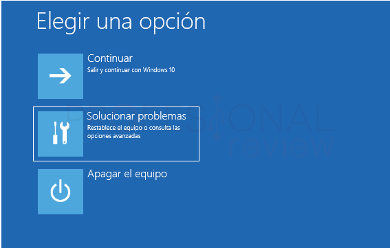
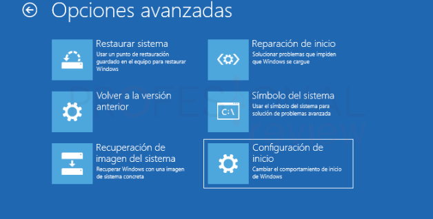
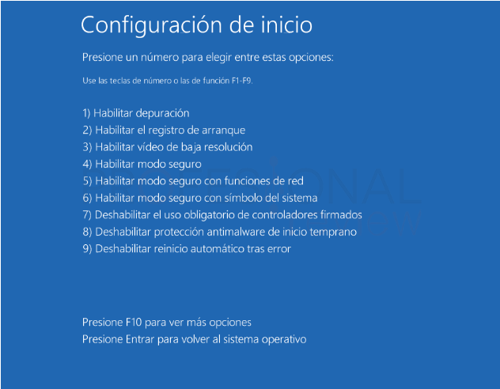
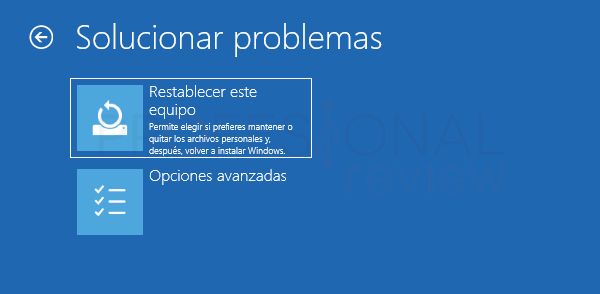

- [Inicio en modo seguro](#inicio-en-modo-seguro)
  - [Configurar opciones de inicio](#configurar-opciones-de-inicio)
  - [Restaurar el sistema](#restaurar-el-sistema)

# Inicio en modo seguro

En la pantalla de bloqueo del sistema pulsamos la tecla ***Mayus*** de nuestro teclado, a la vez que pulsamos sobre el botón de **apagar el sistema** y en la opción ***Reiniciar***

Esto nos mostrará con la opción de abrir el **Soluccionador de problemas**

Desde aquí tendremos un conjunto de opciones que pueden servirnos para arreglar el problema que estemos tratando.

## Configurar opciones de inicio

Una de las opciones que nos ofrece el soluccionador de problemas es el de configurar las opciones de inicio.

1. **Habilitar depuración**:  
   Activa el modo de depuración para solucionar problemas avanzados. Se utiliza principalmente por desarrolladores o técnicos para diagnosticar errores del sistema.

2. **Habilitar el registro de arranque**:  
   Crea un registro de todos los controladores y servicios que se cargan durante el inicio en un archivo llamado `ntbtlog.txt`. Es útil para identificar problemas durante el arranque.

3. **Habilitar vídeo de baja resolución**:  
   Inicia el sistema con configuraciones mínimas de video (por ejemplo, 640x480). Útil para solucionar problemas relacionados con controladores o configuraciones de pantalla incompatibles.

4. **Habilitar modo seguro**:  
   Arranca el sistema con solo los servicios y controladores esenciales. Ideal para solucionar problemas relacionados con software o controladores.

5. **Habilitar modo seguro con funciones de red**:  
   Igual que el modo seguro, pero con acceso a las funciones de red habilitadas. Útil para descargar actualizaciones o controladores mientras se solucionan problemas.

6. **Habilitar modo seguro con símbolo del sistema**:  
   Inicia en modo seguro, pero muestra directamente una interfaz de línea de comandos en lugar de la interfaz gráfica. Útil para tareas avanzadas de solución de problemas.

7. **Deshabilitar el uso obligatorio de controladores firmados**:  
   Permite cargar controladores sin firma digital. Se utiliza para probar o usar controladores antiguos que no están firmados.

8. **Deshabilitar protección antimalware de inicio temprano**:  
   Desactiva las comprobaciones antimalware que se ejecutan al inicio del sistema. Útil si un software legítimo está siendo bloqueado.

9. **Deshabilitar reinicio automático tras error**:  
   Evita que el sistema se reinicie automáticamente después de un fallo. Esto permite leer los mensajes de error y recopilar información sobre la causa del problema.

**Opciones adicionales:**
- **F10 para más opciones**:  
   Probablemente muestra herramientas avanzadas para solucionar problemas.
- **Presione Enter para volver al sistema operativo**:  
   Cancela la selección y arranca el sistema de manera normal.

## Restaurar el sistema 

En este modo también podemos restaurar el sistema ya sea desde el equipo o descargando desde la nube una copia de windows. 

Hay dos opciones, la que elimina todos los datos del usuario y programas y la que los mantiene.

